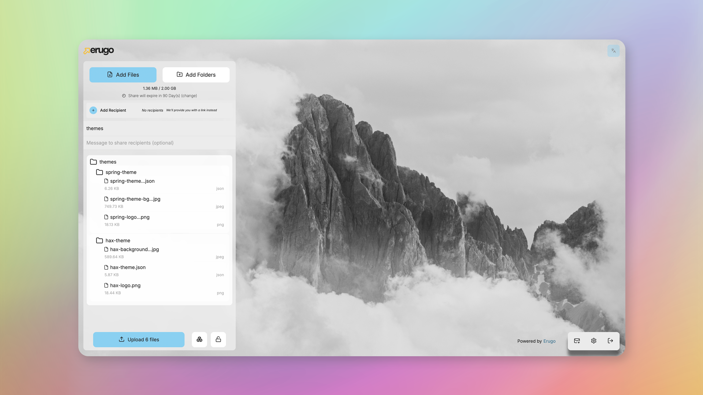
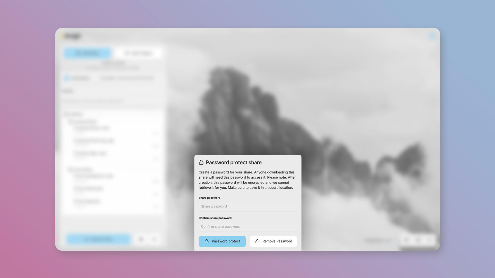
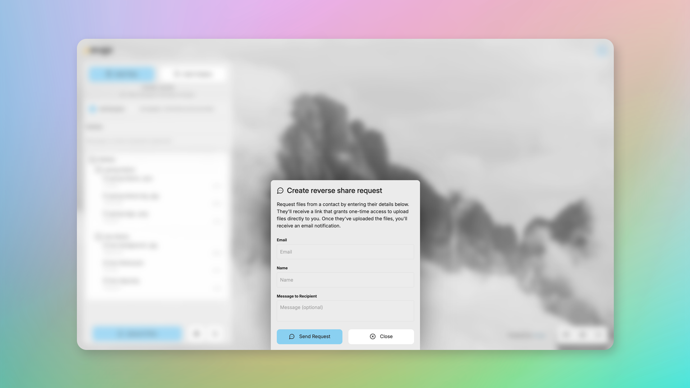

[](https://hub.docker.com/r/wardy784/erugo)     [](LICENSE)

[](https://discord.gg/M74X2wmqY8)

# Erugo

**Your Self-Hosted File Sharing Platform**

Erugo is a powerful, self-hosted file-sharing platform that puts you in **complete control** of your data. Built with PHP/Laravel and a Vue.js frontend, it offers secure, customisable file-transfer capabilities through an elegant user interface.

### Why Self-Host?

- **Your Data, Your Rules** — Files stay on your infrastructure. No third-party access, no data mining, no surprises.
- **Deploy Anywhere** — Run on your own server, VPS, or even a Raspberry Pi. Docker makes setup a breeze.
- **Open Source Forever** — MIT licensed. Inspect the code, contribute features, or fork it for your own needs.

### Support Erugo's Development

If you would like to support Erugo's development, please consider donating to the project. Your support helps me maintain and improve the software.

[](https://ko-fi.com/B0B11BF8EC)

## Quick Start

You can use the example docker-compose.yaml below to run Erugo in a container.

```yaml
services:
  app:
    image: wardy784/erugo:latest
    restart: unless-stopped
    volumes:
      - ./erugo-storage:/var/www/html/storage # Use a dedicated folder
    ports:
      - "9998:80"
```

The above docker-compose.yml provides a basic configuration starting point that will get Erugo up and running with a default sqlite database.

```sh
docker compose up -d
``` 

## Screenshots



_Effortless uploads with multiple file support, progress tracking, and folder support_



_Password protect your shares for extra security_



_Invite guests to upload files to your account with a one-time reverse share token_


_Login screen with external auth provider support_

## Demo

Check out a sample share on our demo site at [demo.erugo.app/shares/tight-silence-sweet-sea](https://demo.erugo.app/shares/tight-silence-sweet-sea). While uploads are disabled on the demo, you can experience the recipient's view and download the sample file.

### Sponsored by BoxToPlay

<a href="https://www.boxtoplay.com/en/vps-hosting/vps-server?ref=erugo-readme">
  
</a>

BoxToPlay offers premium VPS and game servers at competitive prices. They have generously contributed server resources to support Erugo's infrastructure, for which I am deeply grateful. Explore their services at [boxtoplay.com](https://www.boxtoplay.com/en/vps-hosting/vps-server?ref=erugo-readme).


## Videos Featuring Erugo

- ["Erugo - Self-Hosted File Sharing Platform" by DB Tech](https://www.youtube.com/watch?v=zqipBHSSPm4)
- ["Ditch WeTransfer! Self-Host Erugo for Secure File Sharing with Docker" by KeepItTechie](https://www.youtube.com/watch?v=FrcBALXDIRU)

## Community Content
- [Installer Erugo avec Docker (french)](https://belginux.com/installer-erugo-avec-docker/)
- [How to Install Erugo on Your Server: Step-by-Step Guide for Secure File Sharing](https://www.linkedin.com/pulse/how-install-erugo-your-server-step-by-step-guide-secure-montinaro-yzbcf)

## Key Features

### Effortless Uploads
- Multiple file support with progress tracking
- Folder uploads that maintain structure
- Large file support with automatic resume
- Drag and drop interface

### Human-Friendly Share Links
- Generate memorable URLs like `you.com/shares/quiet-cloud-shrill-thunder`
- No more cryptic strings — easy to share and remember

### Security & Access Control
- Optional password protection for shares
- Configurable expiration dates
- Download limits per share
- Only authorized users can create shares

### Customizable Branding
- Built-in themes (light and dark modes)
- Custom themes via the web interface
- Logo and color customization
- Easy white-labeling for your organization

### Powerful Dashboard
- Track downloads and monitor activity
- Manage shares, extend expiration, or revoke access
- Easy user management with invite system

### Additional Features
- **Reverse Share** — Invite guests to upload files to your account with a one-time token
- **Email Support** — Full email support for notifications, password reset, and more
- **Interactive Setup** — User-friendly first-run configuration
- **Zero-Configuration** — Reasonable defaults out of the box
- **Automatic Cleanup** — Shares automatically deleted after expiration
- **Translations** — Fully translatable with multiple languages supported

## How It Works

1. **Upload** — Drag and drop files or select them from your device
2. **Configure** — Set optional password protection, expiration dates, and download limits
3. **Share** — Get a clean, human-readable URL to share with anyone
4. **Manage** — Track downloads, revoke access, or extend expiration dates from your dashboard

## Star History

Give this repository a star to keep track of releases and updates. Stars are also great for motivating me to keep adding features!

[](https://star-history.com/#DeanWard/erugo&Date)

## Customization

As an open-source project, Erugo can be tailored to your needs:

- Customize the UI to match your brand
- Modify URL structures and authentication methods
- Extend functionality through code modifications

## Translations

Currently, the following languages are supported:
- English
- French (Thanks to [@zarev](https://github.com/zarevskaya) & [@thibdevan](https://github.com/thibdevan))
- German
- Italian
- Dutch
- Portuguese (Thanks to Distermaer)

Erugo is fully translatable. If you would like to contribute a translation, please join our [Discord server](https://discord.gg/M74X2wmqY8) and drop a message in general channel.

## Development

Erugo is a Laravel application and uses Laravel Sail to run the development environment.

Run the following commands to start the server, run migrations, and start vite in dev mode.

### Generate database
```sh
touch database/database.sqlite
chmod 666 database/database.sqlite
```

### Install laravel dependencies
```sh
composer install
npm install
sail up -d
```

### Generate .env file
```sh
cp .env.example .env
chmod 666 .env
sail artisan key:generate
sail artisan jwt:secret
```

### Run the development server
```sh
sail artisan migrate
sail artisan db:seed
npm run dev
```

## Build it yourself

To build the docker image yourself, run the following command.

```sh
docker build -t erugo:local -f docker/alpine/Dockerfile .
```
If you would like to push the image to Docker Hub, run the following command. You will need to have a Docker Hub account and be logged in.
```sh
DOCKER_HUB_USERNAME=<your-docker-hub-username> ./publish-docker-image.sh
```

## Contributing

We welcome community contributions! Feel free to:

- Submit bug reports and feature requests
- Translate Erugo to your language
- Create pull requests
- Engage in discussions

## License

Erugo is released under the MIT License, ensuring maximum flexibility for both personal and commercial use.

---

🚀 **Ready to take control of your file sharing? Deploy Erugo in minutes and start sharing securely!**

## Disclaimer

### Intended Use
Erugo is designed for legitimate file-sharing purposes such as transferring work assets, design files, media content, and other non-sensitive data between trusted parties. It is not intended for sharing illegal, harmful, or unauthorized content.

### Administrator Responsibility
As a self-hosted application, administrators who deploy Erugo are solely responsible for:
- Compliance with all applicable local, national, and international laws
- Proper configuration and security of their instance
- Monitoring and moderating the content shared through their instance
- Implementing appropriate terms of service for their users

### No Warranty
ERUGO IS PROVIDED "AS IS", WITHOUT WARRANTY OF ANY KIND, EXPRESS OR IMPLIED, INCLUDING BUT NOT LIMITED TO THE WARRANTIES OF MERCHANTABILITY, FITNESS FOR A PARTICULAR PURPOSE AND NONINFRINGEMENT. IN NO EVENT SHALL THE AUTHORS OR COPYRIGHT HOLDERS BE LIABLE FOR ANY CLAIM, DAMAGES OR OTHER LIABILITY, WHETHER IN AN ACTION OF CONTRACT, TORT OR OTHERWISE, ARISING FROM, OUT OF OR IN CONNECTION WITH THE SOFTWARE OR THE USE OR OTHER DEALINGS IN THE SOFTWARE.

### Recommended Practices
We strongly recommend that administrators:
- Implement access controls to limit who can create shares
- Configure appropriate file size limits
- Set reasonable expiration periods for shares
- Regularly review system logs
- Consider implementing additional monitoring if deploying in production environments

By downloading, installing, or using Erugo, you acknowledge that you have read and understood this disclaimer.
